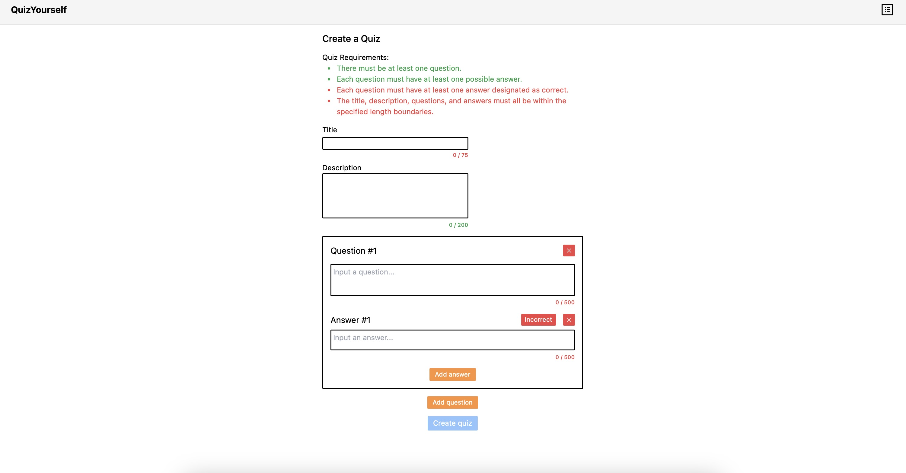

<h1>QuizYourself, a Web Application to Create and Take Quizzes.</h1>

QuizYourself is a responsive web application where users can create quizzes for others to take.

Tech stack: React, Typescript, Tailwind CSS, Prisma (ORM), Node, tRPC

Features:

<ol>
  <li>Username and password sign up and login</li>
  <li>Create and delete quizzes</li>
  <ol>
    <li>Quizzes can contain up to 20 questions, and each question can contain up to 8 answers.</li>
  </ol>
  <li>Take quizzes made by yourself and others</li>
  <li>Profile page containing each user's created quizzes</li>
</ol>

<h2>Local Install Instructions</h2>

To locally install and run this project on your machine:

<ol>
  <li>Clone this Github repository</li>
  <li>Within both the client and server folders, run "npm i"</li>
  <li>Create and run a PostgresQL database named "quiz" at localhost:5432</li>
  <li>Within the server folder, run "npx prisma db push"</li>
  <li>Within the server folder, run "npm run dev"</li>
  <li>Once the server is running, within the client folder, run "npm run dev"</li>
  <li>Navigate to localhost:5173 in a web browser</li>
</ol>

<h2>Images</h2>
<h3>Home Page</h3>

<h3>Completed Quiz</h3>

<h3>Quiz Creation Form</h3>

